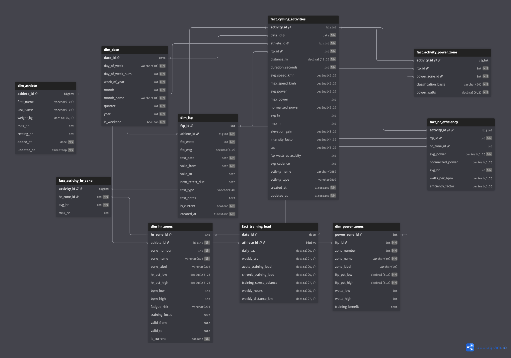

# Strava Analytics Platform

This repository contains an end-to-end data analytics project built on top of data extracted from the Strava API.

The main goal of this project is:
- **Personal performance analysis** of sports activities (initially focused on virtual cycling)
- **Showcasing data analytics and engineering skills**, including data ingestion, transformation, modeling, and visualization

While the current implementation focuses on **virtual cycling activities**, the project is intentionally designed to be scalable. In the future, it may include:
- Other cycling activity types
- Running and workouts
- Broader fitness and training analytics

---

## Project Vision

The long-term vision is to build a small but realistic analytics platform that follows modern data practices:
- API-based data ingestion
- Structured data layers (raw, staging, intermediate, marts)
- Star-schema data modeling (dim and fact tables)
- Automated data pipelines (GitHub Actions)
- Business-friendly visualization (Tableau, PowerBI, Looker, Streamlit)

This repository also serves as a space to **experiment, learn, and exchange ideas** around data development approaches, tooling choices, and analytics best practices.

---

## Architecture (planned)

    Strava API
        │
        ▼
    Python (Ingestion)
        │
        ▼
    PostgreSQL (Neon DB)
    (Raw & Analytics Layers)
        │
        ▼
    dbt
    (Transformations & Modeling)
        │
        ▼
    Looker
    (Visualization)

---

## Data Model

The analytics layer is built using a dimensional (star-schema) model centered on cycling activities, with multiple supporting fact tables for power and heart-rate analytics.

🔗 **Interactive schema (dbdiagram):**  
https://dbdiagram.io/d/strava-data-platform-6971e618bd82f5fce242d2ec

---

## Tech Stack

- Python (API ingestion)
- PostgreSQL
- dbt
- Looker
- GitHub

---

## Repository Structure

    strava-analytics-platform/
    ├── assets/
    │   └── images/
    │       └── strava-logo.png
    ├── ingestion/                     # Strava API ingestion (Python)
    │   ├── src/
    │   │   └── extract.py
    │   ├── requirements.txt
    │   └── README.md
    ├── transformations/               # dbt project (planned)
    │   ├── models/
    │   │   ├── staging/               # stg_* models
    │   │   └── marts/                 # facts & dimensions
    │   │       ├── core/
    │   │       │   ├── fct_activities.sql
    │   │       │   ├── dim_athlete.sql
    │   │       │   └── dim_activity_type.sql
    │   │       └── README.md
    ├── visualization/                 # Tableau assets (planned)
    │   ├── dashboards/
    │   └── screenshots/
    ├── README.md
    └── LICENSE

---

## Project Status & Milestones

### Completed

| Date | Milestone |
|-----|----------|
| 2026-01-20 | Initial Strava API ingestion logic implemented |
| 2026-01-20 | Project and repository structure created |
| 2026-01-21 | Raw Strava data loaded into Neon PostgreSQL |
| 2026-01-21 | Staging (`stg_*`) models built |
| 2026-01-21 | Looker connection tested with MVP dashboard |
| 2026-01-21 | GitHub Actions implemented and validated |
| 2026-01-22 | Dimensional data model designed and physical schema implementation started |

### Planned Next Steps

| Priority | Task | Deadline
|--------|------|--------|
| High | Finalize mart-layer fact and dimension tables | 2026-01-23
| High | Implement full star schema in dbt | 2026-01-23
| Medium | Build Looker dashboard | 2026-01-24
| Low | Design Illustration of Architecture | 2026-01-24

## Glossary (for learning purposes)

| Term | Description |
|-----|------------|
| **Data Model** | Logical design that defines entities, relationships, and analytical grain (e.g., star schema, facts, dimensions). |
| **Schema** | Physical implementation of the data model in a database (tables, columns, data types, constraints). |
| **Fact Table** | Table that stores measurable events or metrics at a defined grain (e.g., cycling activities). |
| **Dimension Table** | Descriptive table that provides context for facts (e.g., athlete, date, FTP, power zones). |
| **Star Schema** | Dimensional modeling pattern with a central fact table connected to denormalized dimension tables. |
| **Fact Constellation** | Dimensional model with multiple fact tables sharing conformed dimensions. |
| **Grain** | The level of detail represented by one row in a table (e.g., one row per activity). |
| **SCD Type 2 (SCD2)** | Slowly Changing Dimension approach that preserves historical changes by creating new rows instead of overwriting data. |
| **Staging Layer** | Cleaned and lightly transformed data layer that mirrors source systems (`stg_*` models in dbt). |
| **Mart Layer** | Analytics-ready layer containing fact and dimension tables for reporting and BI tools. |
